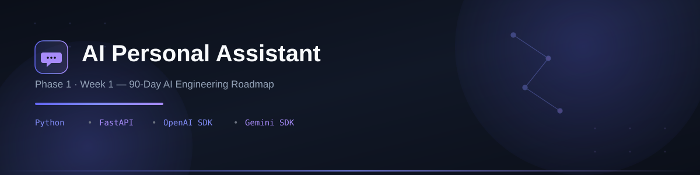

<p align="center">
  
</p>

<p align="center">
  
  
  
  
  
  
  
  
</p>

<p align="center">
  A conversational AI assistant built from the ground up — covering LLM integration, prompt engineering, structured outputs, and API design.<br/>
  First deliverable of a <b>90-day AI Engineering roadmap</b> (Phase 1: Foundation, Week 1).
</p>

---

## 📑 Table of Contents

- [Overview](#-overview)
- [Features](#-features)
- [Demo](#-demo)
- [Installation](#️-installation)
- [How to Run](#️-how-to-run)
- [Architecture](#️-architecture)
- [Folder Structure](#-folder-structure)
- [Future Improvements](#-future-improvements)
- [Roadmap Context](#-roadmap-context)
- [Author](#-author)
- [License](#-license)

---

## 📖 Overview

**AI Personal Assistant** is a lightweight, extensible conversational assistant that integrates both OpenAI and Gemini SDKs, supports structured (schema-validated) outputs, and exposes its logic through a simple API layer. It was built as the foundational project of a 90-day AI Engineering learning sprint, with a focus on writing clean, production-style code rather than throwaway notebook scripts.

This is **Repo 1 of 10+** in a structured roadmap moving from LLM fundamentals → agentic systems → deployable AI products.

---

## ✨ Features

- 🔌 Dual LLM support — switch between **OpenAI** and **Gemini** SDKs
- 🧠 Prompt-engineered response templates (system/user prompt separation)
- 📦 Structured output via schema validation (Pydantic models)
- 🗂️ Simple session memory for multi-turn conversations
- ⚡ FastAPI-based endpoint for programmatic access
- 🧪 Basic test coverage for core assistant logic

---

## 🎥 Demo

*(Add a screenshot or short GIF/video here once available)*

```
assets/screenshots/
```

---

## 🛠️ Installation

```bash
# 1. Clone the repository
git clone https://github.com/Hamna-Munir/01-AI-Personal-Assistant.git
cd 01-AI-Personal-Assistant

# 2. Create a virtual environment
python -m venv venv
source venv/bin/activate      # On Windows: venv\Scripts\activate

# 3. Install dependencies
pip install -r requirements.txt

# 4. Configure environment variables
cp .env.example .env
# then add your OPENAI_API_KEY and GEMINI_API_KEY
```

---

## ▶️ How to Run

```bash
# Run the assistant directly
python src/main.py

# Or run it as an API server
uvicorn src.main:app --reload
```

Once running, the API will be available at:
```
http://127.0.0.1:8000/chat
```

---

## 🏗️ Architecture

```
User Input
   │
   ▼
Prompt Layer (prompts.py)
   │
   ▼
LLM Client (OpenAI / Gemini)
   │
   ▼
Structured Output Parser (models.py)
   │
   ▼
Response → User
```

Session context is tracked via a lightweight in-memory store (`memory.py`), designed to later evolve into a vector-based memory system in Phase 2 of the roadmap.

---

## 📂 Folder Structure

```
01-AI-Personal-Assistant/
│
├── README.md
├── LICENSE
├── .gitignore
├── requirements.txt
├── .env.example
│
├── docs/
│   └── week-01-summary.md
│
├── notes/
│   ├── day-01.md
│   ├── day-02.md
│   ├── day-03.md
│   ├── day-04.md
│   ├── day-05.md
│   ├── day-06.md
│   └── day-07.md
│
├── assets/
│   └── screenshots/
│
├── tests/
│   └── test_assistant.py
│
├── src/
│   ├── __init__.py
│   ├── main.py
│   ├── assistant.py
│   ├── config.py
│   ├── prompts.py
│   ├── memory.py
│   ├── utils.py
│   └── models.py
│
└── journal.md
```

---

## 🚀 Future Improvements

- [ ] Add persistent (vector-based) memory
- [ ] Add function/tool calling support
- [ ] Add streaming responses
- [ ] Deploy as a hosted API (Phase 1 wrap-up)
- [ ] Expand test coverage

---

## 🧭 Roadmap Context

This project is **Week 1 of Phase 1** in a 90-day AI Engineering roadmap:

| Phase | Focus | Days |
|---|---|---|
| Phase 1 | Foundation — AI Personal Assistant | 1–30 |
| Phase 2 | Agent Engineering — RAG, LangGraph, MCP | 31–60 |
| Phase 3 | Business AI Systems — Multi-Agent, Deployment | 61–90 |

---

## 👩‍💻 Author

**Hamna Munir**
Software Engineering & AI/ML Student | Building deployable AI/ML projects

- GitHub: [@Hamna-Munir](https://github.com/Hamna-Munir)
- Hugging Face: [@Hamna27](https://huggingface.co/Hamna27)

---

## 📄 License

This project is licensed under the MIT License — see the [LICENSE](LICENSE) file for details.
